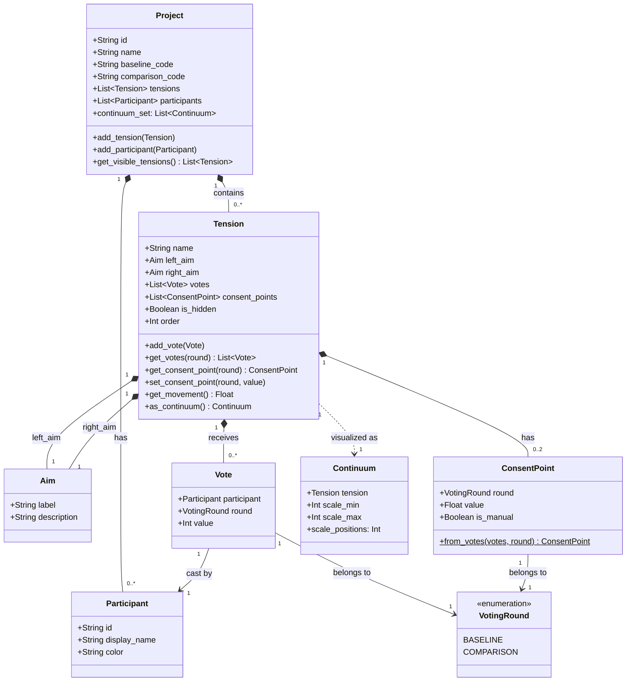

# In/Tension Object Model

## Class Hierarchy



## Terminology Mapping

| Spec Term | Class | Notes |
|-----------|-------|-------|
| Project | `Project` | Container for continuums |
| Aim | `Aim` | Strategic goal, label + description |
| Tension | `Tension` | Two aims that must be balanced |
| Continuum | `Continuum` | Visual representation of a Tension |
| Continuum Set | `Project.continuum_set` | All visible continuums in order |
| Vote | `Vote` | Participant + round + value |
| Baseline | `VotingRound.BASELINE` | First round (current state) |
| Comparison | `VotingRound.COMPARISON` | Second round (desired state) |
| Consent Point | `ConsentPoint` | Average or facilitator override |
| Participant | `Participant` | Voter identity |

## Visualization Mapping

The `Continuum` class maps directly to the SVG visualization:

| Visual Element | Source |
|----------------|--------|
| Title | `Tension.name` |
| Left label | `Tension.left_aim.label` |
| Right label | `Tension.right_aim.label` |
| Scale positions | `Continuum.scale_positions` (11 for 0-10) |
| Vote rectangles | `Tension.get_votes(round)` |
| Average circle | `Tension.get_consent_point(round).value` |
| Movement | `Tension.get_movement()` |

## Example Usage

```python
from models import Project, Tension, Aim, Participant, Vote, VotingRound

# Create project
project = Project(id="workshop-2025", name="AI Strategy Session")

# Add participants
alice = Participant(id="alice", display_name="Alice", color="#4a90d9")
bob = Participant(id="bob", display_name="Bob", color="#d94a4a")
project.add_participant(alice)
project.add_participant(bob)

# Create tension
tension = Tension(
    name="Quality vs Quantity",
    left_aim=Aim(label="Quality", description="Focus on excellence"),
    right_aim=Aim(label="Quantity", description="Focus on volume")
)
project.add_tension(tension)

# Record baseline votes
tension.add_vote(Vote(participant=alice, round=VotingRound.BASELINE, value=3))
tension.add_vote(Vote(participant=bob, round=VotingRound.BASELINE, value=5))

# Get consent point (auto-calculated as average = 4.0)
cp = tension.get_consent_point(VotingRound.BASELINE)
print(f"Baseline average: {cp.value}")  # 4.0

# Facilitator can override
tension.set_consent_point(VotingRound.BASELINE, 3.5)

# Get continuum for rendering
continuum = tension.as_continuum()
```
